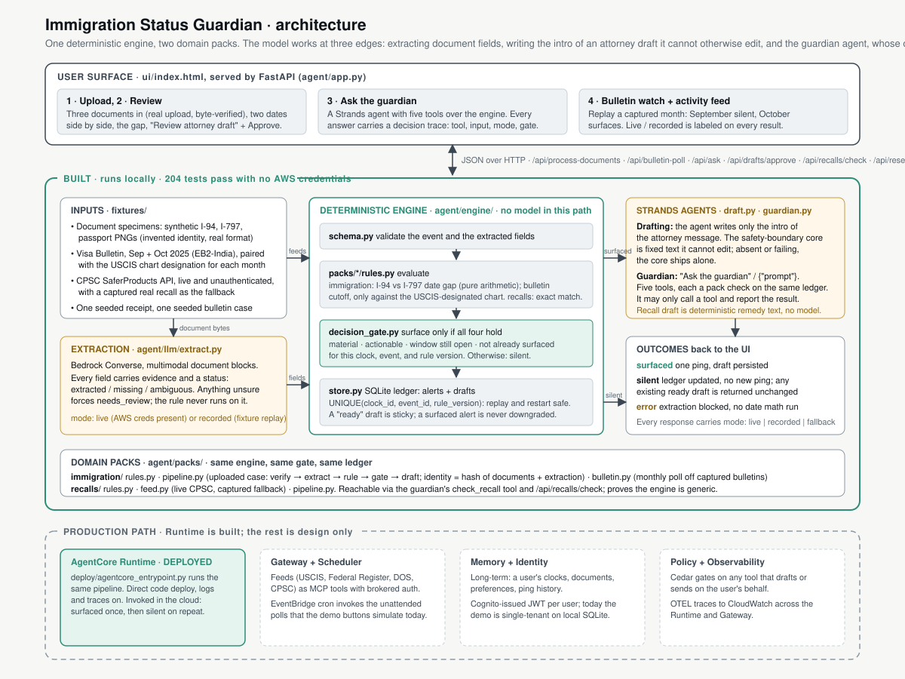

# Immigration Status Guardian

Built for AWS "Agents for Humans" (Strands Agents SDK, Everyday track, due Sep 14, 2026).

## What it does

Flags a **document-date discrepancy** between a person's I-94 and I-797 (a common H-1B situation: CBP admits someone only until their passport expiry, which can be much earlier than what their approval notice says) and drafts a message for their attorney to review. It never states a lawful-status length, an unlawful-presence conclusion, or a filing recommendation — every output is framed as a flag for attorney review, not legal advice.

A second, deliberately thin pack (`agent/packs/recalls/`) matches a live consumer-recall feed to a receipt, proving the same watch → evaluate → gate → surface engine works on an unrelated domain. It is demo-scope (exact match against one seeded receipt), not a general-purpose matcher — see "Known scope limits" below.

## Who it's for

H-1B holders and their attorneys, and international students/workers generally, whose status depends on documents issued by different agencies (CBP, USCIS) on different clocks that can silently disagree.

## How it works



One deterministic engine, two domain packs:

```
agent/
  engine/   schema.py, store.py (SQLite), decision_gate.py, engine.py — the
            deterministic control flow. No LLM in this path.
  llm/      extract.py (Bedrock Converse document extraction, with per-field
            evidence and explicit missing/ambiguous handling),
            document_client.py (live Bedrock when AWS credentials exist,
            otherwise replays a recorded response; the same validation runs
            either way), draft.py (attorney message — a fixed, always-present
            safety-boundary core; a Strands Agent may only add a personalized
            intro around it, never edit it)
  packs/
    immigration/  rules.py (I-94/I-797 date-gap check; bulletin-cutoff check
                  requiring the USCIS-designated chart), pipeline.py (sample
                  case end to end), bulletin.py (unattended monthly poll)
    recalls/      rules.py (exact manufacturer+product match, demo-scope),
                  feed.py (live CPSC API, captured fallback), pipeline.py
  app.py    FastAPI backend serving the API + the static UI
ui/index.html   static demo UI: "Case review" and "Recall demo" tabs, plus
                demo controls that simulate an upload or a scheduled poll
fixtures/sample_case/   three synthetic specimen images + a recorded extraction
fixtures/bulletins/     two real consecutive Visa Bulletin months with the USCIS
                        chart designation, one seeded case (see its README)
fixtures/recalls/       one seeded receipt + a captured real CPSC recall
deploy/   agentcore_entrypoint.py — AgentCore Runtime entrypoint (deployed)
tests/    113 offline tests (rules, extraction, decision gate, bulletin poll,
          recall pipeline, replay-safe dedup, Runtime entrypoint) + 4 opt-in live
```

**The rules engine is deterministic Python, not an LLM judgment call.** The model is only ever called for two things: extracting fields from a document, and writing the plain-English wrapper around a rules-engine result it cannot alter. See `docs/architecture-spec.md` §4.2 for why this boundary is enforced in code rather than in a prompt.

**The decision gate** (`agent/engine/decision_gate.py`) is why the agent stays quiet: an event only surfaces if it's material, actionable, has an open window, and hasn't already been surfaced for the same event. Everything else updates the ledger silently.

## Demo flows

All four run from the demo controls in the UI, on a clean `data/demo.db`:

1. **Load sample case.** Three specimen images go through extraction, then the I-94/I-797 date-gap rule. The 55-day gap surfaces once, with an attorney draft. Loading it again is silent and returns the same draft.
2. **Show decision gate.** The same engine on three events: one surfaces, two stay silent, each with its reason.
3. **Poll bulletin, September then October 2025.** Simulates the unattended monthly check. September: the priority date is not current, silent. October: USCIS switches to the Dates for Filing chart, the date is current, one ping with a draft.
4. **Run recall check.** The seeded receipt against the live CPSC feed, or the captured recall if offline. One ping: refund or voucher.

## Known scope limits (by design, for this deadline)

- **No lawful-status, F-1/OPT, or unlawful-presence computation.** That domain logic (INA §212(a)(9)(B) bars, status-length math) is deferred to a later iteration — see `HANDOFF.md`. This build only compares two document dates arithmetically.
- **Recall matching is demo-scope**: exact manufacturer+product match against one seeded receipt, not a general fuzzy matcher. Labeled as such in the UI and here so a judge testing their own receipt doesn't mistake it for general-purpose.
- **Sample case only, no real document uploads** in the live demo — `fixtures/sample_case/specimens/` holds three synthetic images (invented identity and dates in the real I-94/I-797/passport format) and `recorded_extraction_response.json` is what Bedrock returned for them, so nobody uploads real immigration documents to a hackathon URL. With AWS credentials the same specimens go through live Bedrock extraction.
- **The bulletin beat is a historical replay, not a live fetch.** travel.state.gov blocks automated fetching, so the September and October 2025 bulletins are captured fixtures; their provenance and corroborating sources are in `fixtures/bulletins/README.md`.

## AgentCore Runtime (deployed)

The same pipeline runs on Amazon Bedrock AgentCore Runtime through `deploy/agentcore_entrypoint.py`, with no engine or pack logic changed. Deployed 2026-09-11 as a direct code deploy (no container), observability on (CloudWatch logs and X-Ray traces), memory off:

```
arn:aws:bedrock-agentcore:us-east-1:654654285440:runtime/immigration_status_guardian-SCAdbeBj6Z
```

Payloads: `{}` runs the sample case with recorded extraction, `{"extraction": "live"}` runs live Bedrock extraction, `{"fields": {...}}` skips extraction and runs the rule on the given dates. Verified in the cloud: the first invoke surfaces the 55-day gap with an attorney draft, the second is silent and returns the same draft.

To deploy your own copy:

```bash
pip install -e ".[deploy]" bedrock-agentcore-starter-toolkit
agentcore configure -e deploy/agentcore_entrypoint.py -n immigration_status_guardian \
  -ni --region us-east-1 --disable-memory --deployment-type direct_code_deploy
# In .bedrock_agentcore.yaml set source_path to the repo root, so agent/ and fixtures/ ship.
agentcore deploy
agentcore invoke '{}'
```

Notes: the toolkit resolves dependencies from the root `requirements.txt`, which exists only for that purpose. AWS now recommends the Node CLI (`npm install -g @aws/agentcore`); the Python toolkit still deploys. Draft personalization needs Bedrock model access on the account; without it the response carries `used_llm_personalization: false` and the deterministic core ships alone.

## Production path (not built for this deadline)

AgentCore Memory, Identity (Cognito), Policy (Cedar), Observability (OTEL), and Gateway-brokered auth for the external feeds are real requirements for shipping this beyond a demo — see `docs/architecture-spec.md` §4.6 for the design. AgentCore Runtime itself is deployed and verified (section above); the rest of this list is design only.

## Setup

Requires Python 3.11+ and, for anything beyond the rules-engine tests, AWS credentials with Bedrock model access (used for document extraction and draft personalization even when running locally — this is not an AgentCore-only dependency).

```bash
python -m venv .venv && source .venv/bin/activate   # or: uv venv && uv pip install -e ".[dev]"
pip install -e ".[dev]"
pytest                             # 113 offline tests, no AWS credentials required
pytest -m live                     # 4 live tests: need Bedrock access and network
uvicorn agent.app:app --reload     # demo backend + UI at http://127.0.0.1:8000/
```

## Pre-existing code

None. All code in this repository was written new during the hackathon submission window (Aug 10–Sep 14, 2026).

## License

MIT — see `LICENSE`.
