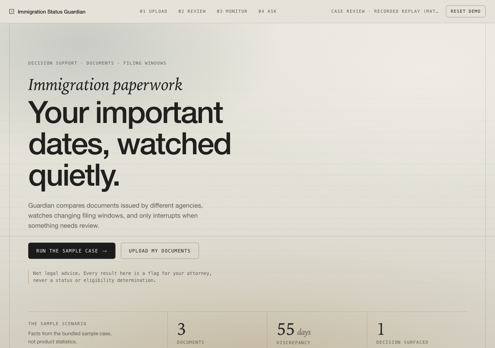
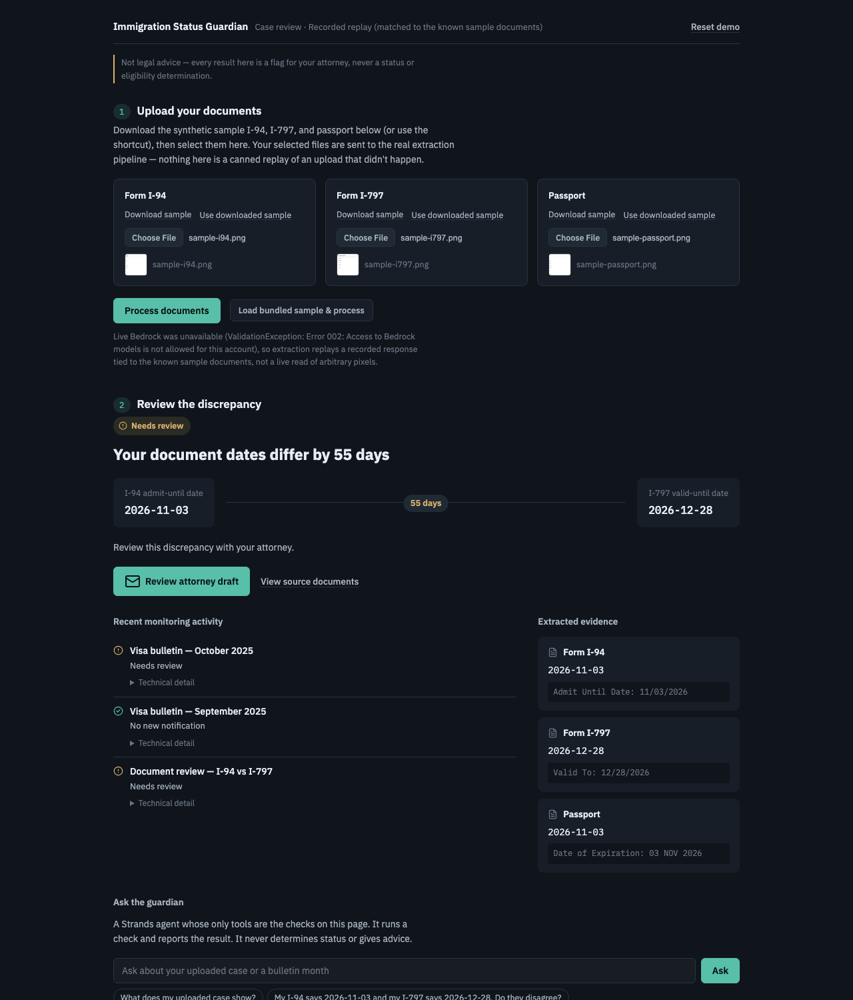
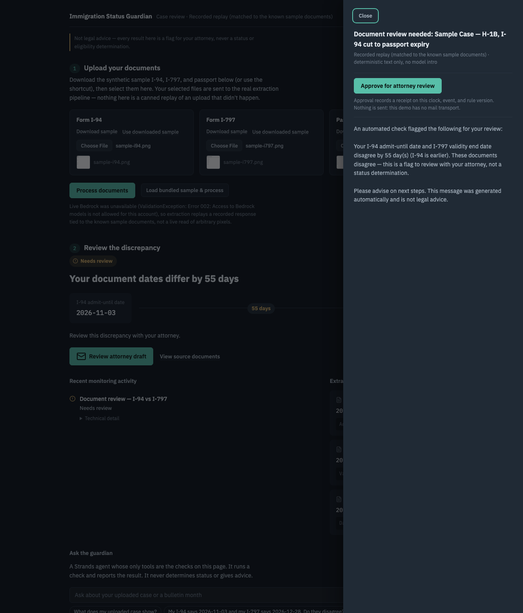

# Immigration Status Guardian

[](https://github.com/anikeitvadi/agents-for-humans/actions/workflows/tests.yml)

**One engine that reads the government so you don't have to.** Built for AWS "Agents for Humans" (Strands Agents SDK, Everyday track, due Sep 14, 2026), deployed on Amazon Bedrock AgentCore Runtime.

If you live in the US on a visa, your stay runs on dates from agencies that don't talk to each other. This agent reads the documents, compares the dates the way a paralegal would, and interrupts you exactly once: "Your document dates differ by 55 days. Review this with your attorney." Then it goes quiet, and keeps watching the Visa Bulletin for you.



## Quickstart (about a minute)

```bash
git clone https://github.com/anikeitvadi/agents-for-humans.git && cd agents-for-humans
python -m venv .venv && source .venv/bin/activate        # or: uv venv && uv pip install -e ".[dev]"
pip install -e ".[dev]"
pytest                                                    # 204 offline tests, no AWS needed
uvicorn agent.app:app --reload                            # http://127.0.0.1:8000/
```

Open the page and click **Run the sample case** in the opening screen (or **Load bundled sample & process** in the upload section) — this downloads the three synthetic specimen images and sends them through the real upload endpoint, exactly as if you'd selected your own files with **Choose File** (there is no canned/simulated path). Then process again (silent, draft kept), **Replay September update** (silent), **Replay October update** (one ping). Or open `http://127.0.0.1:8000/?demo=full` to watch it run. No AWS credentials needed: without them extraction replays a recorded response verified against the known specimen bytes, and says so on screen.

## Screenshots

| The review section, after the full guided demo | The attorney draft, with approval |
|---|---|
|  |  |

## What it does

Flags a **document-date discrepancy** between a person's I-94 and I-797 (a common H-1B situation: CBP admits someone only until their passport expiry, which can be much earlier than what their approval notice says) and drafts a message for their attorney to review. It never states a lawful-status length, an unlawful-presence conclusion, or a filing recommendation — every output is framed as a flag for attorney review, not legal advice.

A second, deliberately thin pack (`agent/packs/recalls/`) matches a live consumer-recall feed to a receipt, proving the same watch → evaluate → gate → surface engine works on an unrelated domain. It is demo-scope (exact match against one seeded receipt), not a general-purpose matcher — see "Known scope limits" below. Its backend, pipeline, and tests are fully present and exercised (`agent/packs/recalls/`, `tests/test_recall_pipeline.py`, `tests/test_recalls_rules.py`), but it is not surfaced in the primary UI, which tells one connected immigration story end to end (upload → review → attorney draft → ask the guardian → bulletin watch).
## Who it's for

H-1B holders and their attorneys, and international students/workers generally, whose status depends on documents issued by different agencies (CBP, USCIS) on different clocks that can silently disagree.
## Why it matters

- **The I-94, not the approval notice, is the date that counts.** CBP's own fact sheet: "The 'Admit Until Date' is the date that the traveler's immigration status expires in the U.S." ([CBP, "I-94 Expiration Dates" fact sheet, Publication No. 0326-0715](https://www.cbp.gov/sites/default/files/documents/502386%20-%20I-94%20Fact%20Sheet_OFO.pdf)).
- **A passport that expires first silently shortens it.** "If your passport expires before the end of the requested H-1B employment (petition expiration date), your I-94 may be truncated (shortened) to expire at the same time as your passport, rather than the H-1B petition." ([University of Kansas HR, "Understanding Your Status Expiration"](https://humanresources.ku.edu/understanding-your-status-expiration)). Practitioners describe the same rule: the I-94 is issued "for the duration of your approval notice OR for the duration of your passport whichever comes first" ([Minsky, McCormick & Hallagan, P.C.](https://www.mmhpc.com/my-i-94-has-a-different-expiration-date-than-my-approval-notice-help/)). That is the exact discrepancy in the sample case.
- **The bulletin beat is a real monthly decision.** USCIS designates each month which of two State Department charts applies: "If USCIS determines there are more immigrant visas available for a fiscal year than there are known applicants for such visas, we will state on this page that you may use the Dates for Filing chart. Otherwise, we will indicate on this page that you must use the Final Action Dates chart" ([USCIS, "Adjustment of Status Filing Charts from the Visa Bulletin"](https://www.uscis.gov/green-card/green-card-processes-and-procedures/visa-availability-priority-dates/adjustment-of-status-filing-charts-from-the-visa-bulletin)). The captured September and October 2025 fixtures are the month USCIS switched charts.
- **The population is large and waits a long time.** Over 1.2 million Indian nationals were in the EB-1, EB-2, and EB-3 backlog (1,259,443) per a National Foundation for American Policy analysis of USCIS data as of November 2, 2023 ([Boundless, March 7, 2025](https://www.boundless.com/blog/1-million-indians-stuck-green-card-backlog)).
- **The recall pack runs on a public feed.** The CPSC Recalls API "provides machine readable access to publicly available recall information visible on cpsc.gov" at `https://www.saferproducts.gov/RestWebServices/Recall`, JSON with `&format=json`, no key ([CPSC, "Recalls Application Program Interface (API) Information"](https://www.cpsc.gov/Recalls/CPSC-Recalls-Application-Program-Interface-API-Information)).

## How it works


One deterministic engine, two domain packs:

```
agent/
  engine/   schema.py, store.py (SQLite), decision_gate.py, engine.py — the
            deterministic control flow. No LLM in this path.
  llm/      extract.py (Bedrock Converse document extraction, with per-field
            evidence and explicit missing/ambiguous handling),
            document_client.py (live Bedrock when AWS credentials exist,
            otherwise replays a recorded response; the same validation runs
            either way), draft.py (attorney message — a fixed, always-present
            safety-boundary core; a Strands Agent may only add a personalized
            intro around it, never edit it), guardian.py (the conversational
            agent: a Strands Agent whose only tools are the engine's checks)
  packs/
    immigration/  rules.py (I-94/I-797 date-gap check; bulletin-cutoff check
                  requiring the USCIS-designated chart, with malformed-source
                  validation), pipeline.py (real document-upload extraction,
                  bound to a derived immutable identity), bulletin.py
                  (unattended monthly poll)
    recalls/      rules.py (exact manufacturer+product match, demo-scope),
                  feed.py (live CPSC API, captured fallback), pipeline.py
  app.py    FastAPI backend serving the API + the static UI
ui/index.html   the demo page, one file, no external dependencies: opening
                scene, real document upload, the review (55-day figure,
                evidence, attorney draft + approval), bulletin replays with
                per-month verdicts, and the guardian with its decision trace
fixtures/sample_case/   three synthetic specimen images + a recorded extraction,
                        byte-verified against uploads in recorded mode
fixtures/bulletins/     two real consecutive Visa Bulletin months with the USCIS
                        chart designation, one seeded case (see its README)
fixtures/recalls/       one seeded receipt + a captured real CPSC recall
deploy/   agentcore_entrypoint.py — AgentCore Runtime entrypoint (deployed)
tests/    204 offline tests (rules, extraction, decision gate, bulletin poll,
          recall pipeline, guardian agent + trace + uploaded-case binding,
          Bedrock-denied fallback, approval receipts, upload identity/
          isolation, PNG validation, concurrency/reset-epoch, Runtime
          entrypoint) + 5 opt-in live tests, all verified against real
          Bedrock (see Evidence below)
```

**The rules engine is deterministic Python, not an LLM judgment call.** The model is only ever called for two things: extracting fields from a document, and writing the plain-English wrapper around a rules-engine result it cannot alter. See `docs/architecture-spec.md` §4.2 for why this boundary is enforced in code rather than in a prompt.

**The guardian agent** (`agent/llm/guardian.py`) is the conversational front door, in the UI ("Ask the guardian"), at `POST /api/ask`, and as the `{"prompt": ...}` payload on the AgentCore Runtime. It is a Strands Agent with five tools, each a thin wrapper over a pack function bound to the same ledger the UI uses: `check_document_dates`, `run_sample_case_check` (the bundled demo sample only), `check_uploaded_case` (the specific case the person just uploaded, bound to an explicit submission reference from that upload — never a silent rerun of the bundled sample), `check_visa_bulletin`, `check_recall`. Its system prompt forbids computing dates or stating status itself; it can only call a tool and report the result, and every answer lists the tools it called. A fresh agent runs per question, so requests are stateless. Tests drive the real Strands tool loop with a scripted model (`tests/scripted_model.py`), so none of this depends on Bedrock being reachable — and the same paths are also verified against live Bedrock (see Evidence).

**Every uploaded case has its own immutable identity.** `run_case_from_documents` (`agent/packs/immigration/pipeline.py`) derives its ledger key from the *complete* extraction result — fields, evidence, statuses, mode, and a sha256 of each uploaded document — not from the extracted dates alone or a fixed placeholder id. Two different document sets that happen to extract the same dates get distinct identities; replaying the exact same documents deterministically retrieves the same draft and approval. The guardian, the approval endpoint, and the UI all read/write through this same derived reference.

**Uploads are validated before any model call.** Every file is decoded (not just magic-byte checked) to confirm it is a real, uncorrupted PNG; a truncated file with a valid PNG signature is rejected. In recorded mode, each uploaded file's bytes must match a known bundled specimen (by hash) before the recorded response is trusted — an arbitrary or swapped file never gets treated as the known sample.

**Failure is visible, never silent.** Credentials are not proof that Bedrock works. The extraction client tries live Bedrock and, on the first API failure, falls back to the recorded replay for the life of the process (`FailoverExtractionClient`); if it fails over *partway* through a batch, the result is refused rather than silently mixing a live field with recorded ones. Every response carries `mode` (`live` or `recorded`) and, after a fallback, `mode_reason` with the real error, and the UI shows both. The upload endpoint offloads the (potentially slow) extraction/model work to a threadpool so it never blocks other requests, and a reset that happens mid-upload aborts that upload instead of letting it write a result afterward. The web app returns JSON on every error, and the UI's single fetch helper (with explicit multipart support for uploads) turns non-2xx, non-JSON, timeout, and network failures into a visible banner.

**The decision trace.** Every guardian answer ships with structured execution facts read straight from the Strands message history: for each tool call, the tool, its input, the result status, the data mode, the deterministic gate decision and reason, and whether a draft was persisted. Never model reasoning.

**One human action.** "Approve for attorney review" records an idempotent receipt (clock, event, rule version, action, timestamp) in the ledger. Nothing is sent; there is no mail transport and the UI never claims one.

**The decision gate** (`agent/engine/decision_gate.py`) is why the agent stays quiet: an event only surfaces if it's material, actionable, has an open window, and hasn't already been surfaced for the same event. Everything else updates the ledger silently.
## Sample scenarios

Three bundled synthetic document sets, selectable in the upload section (`/api/scenarios`, `agent/packs/immigration/scenarios.py`):

| Scenario | What the documents say | Expected outcome |
|---|---|---|
| I-94 cut to passport expiry | I-94 admit-until 2026-11-03, I-797 valid to 2026-12-28 | Surfaced: one ping, one draft |
| Dates agree | I-94 and I-797 both end 2026-12-28 | Silent on the primary flow, not just on repeats |
| Passport expiry unreadable | The passport's expiration line is smudged | Needs review: extraction reports the field missing and the rule refuses to run |

Recorded mode identifies each document by the sha256 of its bytes, so a swapped or edited file never gets another file's replay. A scenario is usable offline only once its live Bedrock response has been recorded with `scripts/record_extraction.py --scenario <name>`; until then the picker labels it "live Bedrock only".

## Unattended run and the ping

The scheduled beat is real, not a button. `deploy/unattended/provision.sh` creates an SNS topic with an email subscription, a Lambda that invokes the AgentCore Runtime with `{"check": "bulletin", "month": "2025-10", "notify_topic_arn": ...}`, and an EventBridge schedule (daily by default). The Runtime runs the same engine, gate, and ledger as the UI's replay buttons and publishes exactly one ping when the gate surfaces; a repeat run stays silent and returns the same draft. The response carries `notified`, the SNS `message_id`, and the topic, so the outcome is inspectable in CloudWatch.

```bash
AGENT_RUNTIME_ARN=arn:aws:bedrock-agentcore:us-east-1:<account>:runtime/<id> NOTIFY_EMAIL=you@example.com bash deploy/unattended/provision.sh
aws lambda invoke --function-name guardian-unattended-check --payload '{"month":"2025-10"}' --cli-binary-format raw-in-base64-out /dev/stdout
```

`{"probe": "visa_bulletin"}` on the Runtime reports whether the live State Department bulletin page is reachable from inside AWS (it blocks many home networks); a positive result is the first step toward replacing the captured bulletins.

## Approval delivery

"Approve for attorney review" always records the receipt. When the deployment has a verified SES sender (`GUARDIAN_SES_SENDER`), the draft panel also offers an attorney address and the draft is sent through Amazon SES; the state reads "Approved and sent to ..." only when SES confirms a message id, and "Approved and ready to send" otherwise. Without SES configured the UI never shows the field and never claims a send.

## Public demo mode

`GUARDIAN_PUBLIC_DEMO=1` (set in `apprunner.yaml`) makes a shared URL safe: uploads are limited to the bundled synthetic sets (any other file is refused with a clear message, so nobody's real papers can be processed), per-client request caps return HTTP 429, and the page shows a "synthetic documents only" notice from `/api/config`. Deploy with App Runner from this repository using `apprunner.yaml`.

## Known scope limits (by design, for this deadline)

- **No lawful-status, F-1/OPT, or unlawful-presence computation.** That domain logic (INA §212(a)(9)(B) bars, status-length math) is deferred to a later iteration — see `HANDOFF.md`. This build only compares two document dates arithmetically.
- **Recall matching is demo-scope**: exact manufacturer+product match against one seeded receipt, not a general fuzzy matcher. The recall pack's backend/tests are real and exercised, but it's not surfaced in the primary UI (see "How it works").
- **The demo only ever uploads synthetic specimens**, not real immigration documents — `fixtures/sample_case/specimens/` holds three synthetic images (invented identity and dates in the real I-94/I-797/passport format) and `recorded_extraction_response.json` is what Bedrock returned for them. The upload flow itself is real (your selected file's bytes are what get sent and extracted, not a canned replay); the specimens are what a judge should select so nobody uploads real immigration documents to a hackathon URL. With AWS credentials the same specimens go through live Bedrock extraction end to end (see Evidence).
- **PNG only** for this build — the upload accepts and validates PNG images; JPEG/other formats are rejected with a controlled error rather than silently mis-labeled.
- **The bulletin beat is a historical replay, not a live fetch.** travel.state.gov blocks automated fetching, so the September and October 2025 bulletins are captured fixtures; their provenance and corroborating sources are in `fixtures/bulletins/README.md`.
## AgentCore Runtime (deployed)

**This deployment predates the upload-flow reconciliation below and has not been redeployed with it.** It reflects the sample-case-only code as it stood when deployed; `run_sample_case`'s signature and the guardian's tool set have since changed. Redeploying (`agentcore deploy`) with the current code is still outstanding — see HANDOFF.md.

The same pipeline runs on Amazon Bedrock AgentCore Runtime through `deploy/agentcore_entrypoint.py`, with no engine or pack logic changed. Deployed 2026-09-11 as a direct code deploy (no container), observability on (CloudWatch logs and X-Ray traces), memory off:

```
arn:aws:bedrock-agentcore:us-east-1:654654285440:runtime/immigration_status_guardian-SCAdbeBj6Z
```

Payloads: `{"prompt": "Do my documents disagree?"}` asks the guardian agent (it picks and runs a tool, then answers with a decision trace); `{}` runs the sample case with recorded extraction; `{"extraction": "live"}` runs live Bedrock extraction; `{"fields": {...}}` skips extraction and runs the rule on the given dates. Verified in the cloud: the first invoke surfaces the 55-day gap with an attorney draft, the second is silent and returns the same draft.

To deploy your own copy:

```bash
pip install -e ".[deploy]" bedrock-agentcore-starter-toolkit
agentcore configure -e deploy/agentcore_entrypoint.py -n immigration_status_guardian \
  -ni --region us-east-1 --disable-memory --deployment-type direct_code_deploy
# In .bedrock_agentcore.yaml set source_path to the repo root, so agent/ and fixtures/ ship.
agentcore deploy
agentcore invoke '{}'
```

Notes: the toolkit resolves dependencies from the root `requirements.txt`, which exists only for that purpose. AWS now recommends the Node CLI (`npm install -g @aws/agentcore`); the Python toolkit still deploys. Draft personalization needs Bedrock model access on the account; without it the response carries `used_llm_personalization: false` and the deterministic core ships alone.
## Evidence

**Live Bedrock, verified 2026-09-11 (after Anthropic's model use-case form cleared for the AWS account).** All three of the model-dependent pieces — document extraction (vision), the guardian agent, and draft personalization — were confirmed end to end against real Bedrock, not just the recorded fallback:

**Offline test suite** (`pytest -q`, no AWS credentials):

```
204 passed, 5 deselected
```

**Live test suite** (`pytest -m live -q`, real AWS credentials + Bedrock model access):

```
5 passed
```

Combined (`pytest -q -m ''`): **209** (204 offline + 5 live).

**Real upload through `POST /api/process-documents`, live mode** (abbreviated):

```json
{
  "mode": "live", "mode_reason": null,
  "fields": {"admit_until": "2026-11-03", "i797_valid_until": "2026-12-28", "passport_expiry": "2026-11-03"},
  "evidence": {"admit_until": "11/03/2026", "i797_valid_until": "12/28/2026", "passport_expiry": "03 NOV 2026"},
  "needs_review": false,
  "alert": {"decision": "surfaced", "reason": "passed materiality, actionability, window, novelty"},
  "draft": {"used_llm_personalization": true, "subject": "Document review needed: Sample Case — H-1B, I-94 cut to passport expiry", ...}
}
```

Note the model reads each date in the document's own printed format (`evidence`) but the prompt asks it to normalize `value` to ISO 8601 — this exact live response is what caught and fixed two real bugs during verification: the model wraps JSON in a markdown code fence (now stripped before parsing), and without an explicit normalization instruction it returns non-ISO dates that R3's validation would otherwise always flag as `ambiguous` (see `agent/llm/extract.py`).

**Guardian agent, `POST /api/ask`, live mode**, asked about the specific uploaded case above (not the bundled sample):

```json
{
  "tools_called": ["check_uploaded_case"],
  "trace": [{"tool": "check_uploaded_case", "status": "success", "mode": "live", "decision": "surfaced", "persisted_draft": true}],
  "answer": "The uploaded case shows one issue that needs your review. ... disagree by 55 days ..."
}
```

**Bedrock-denied fallback still works** (regression, credentials present but access denied — `tests/test_bedrock_denied_fallback.py`):

```
mode=recorded  needs_review=False
mode_reason=live Bedrock extraction unavailable (ValidationException: Error 002: Access to Bedrock models is not allowed for this account); replaying the recorded response
```

**AgentCore Runtime, deployed and invoked** (`agentcore invoke '{}'` twice, real output, abbreviated):

```
arn:aws:bedrock-agentcore:us-east-1:654654285440:runtime/immigration_status_guardian-SCAdbeBj6Z
#1 {"path": "sample_case", "extraction_mode": "recorded", "alert": {"decision": "surfaced", "reason": "passed materiality, actionability, window, novelty"}, "draft": {"subject": "Document review needed: Sample Case — H-1B, I-94 cut to passport expiry", "used_llm_personalization": false, ...}}
#2 {"path": "sample_case", "extraction_mode": "recorded", "alert": {"decision": "silent", "reason": "failed: novelty"}, "draft": {...same draft...}}
```

Direct code deploy, memory off, CloudWatch logs and X-Ray traces on. The `{"prompt": ...}` path was added after that deploy and needs a redeploy (`agentcore deploy`) before it is live in the cloud.

**Strands tool calls and the decision trace** (offline, scripted model driving the real Strands tool loop; this is what `POST /api/ask` returns):

```json
{
  "question": "Run the sample case check.",
  "answer": "One thing needs your review: the I-94 and I-797 dates differ by 55 days. An attorney-review draft is ready.",
  "tools_called": [
    "run_sample_case_check"
  ],
  "trace": [
    {
      "step": 1,
      "tool": "run_sample_case_check",
      "tool_use_id": "use-1",
      "input": {},
      "status": "success",
      "mode": "recorded",
      "decision": "surfaced",
      "reason": "passed materiality, actionability, window, novelty",
      "persisted_draft": true,
      "summary": "passed materiality, actionability, window, novelty"
    }
  ]
}
```

**Browser verification** (Chrome, 2026-09-11, repeated after the 2026-09-14 redesign at desktop and 390px): load bundled sample & process (real upload through the actual endpoint), reprocess (silent, draft kept), open draft, approve (receipt shown, activity row added), close, ask the guardian about the uploaded case (live, correct decision trace), decision gate, reset (clean empty state). No console errors. The recall pack is backend-only now (see "How it works"), so it is not part of this UI click-through.

## Production path (not built for this deadline)

AgentCore Memory, Identity (Cognito), Policy (Cedar), Observability (OTEL), and Gateway-brokered auth for the external feeds are real requirements for shipping this beyond a demo — see `docs/architecture-spec.md` §4.6 for the design. AgentCore Runtime itself is deployed and verified (section above); the rest of this list is design only.
## Setup

Requires Python 3.11+ and, for anything beyond the rules-engine tests, AWS credentials with Bedrock model access (used for document extraction and draft personalization even when running locally — this is not an AgentCore-only dependency).

```bash
python -m venv .venv && source .venv/bin/activate   # or: uv venv && uv pip install -e ".[dev]"
pip install -e ".[dev]"
pytest                             # 204 offline tests, no AWS credentials required
pytest -m live                     # 5 live tests: need Bedrock model access and network
uvicorn agent.app:app --reload     # demo backend + UI at http://127.0.0.1:8000/
```
## Pre-existing code

None. All code in this repository was written new during the hackathon submission window (Aug 10–Sep 14, 2026).
## License

MIT — see `LICENSE`.
