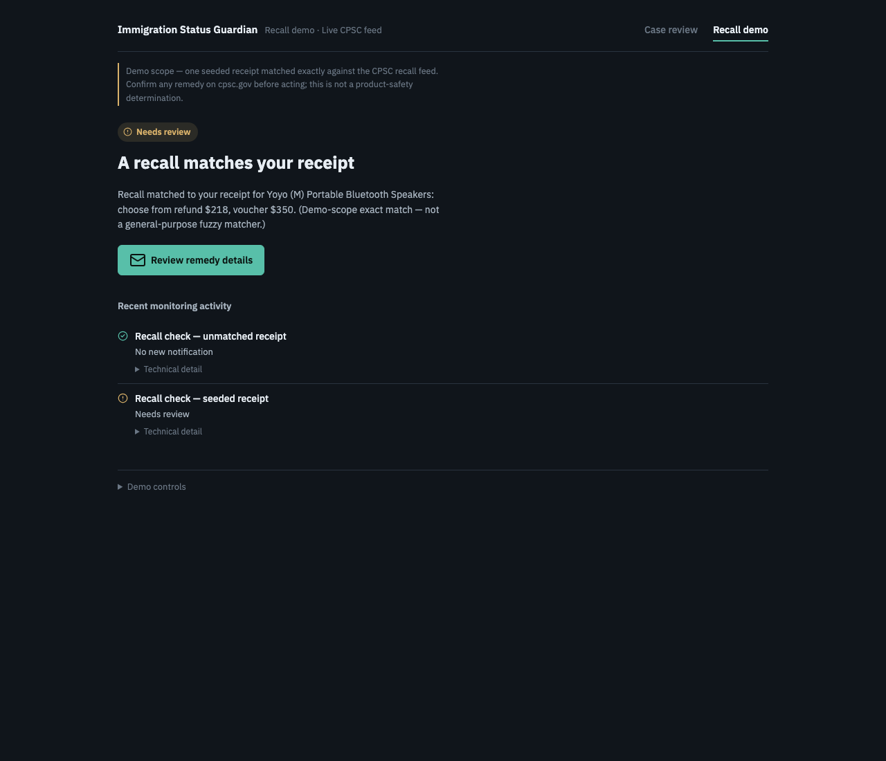

# Immigration Status Guardian

**One engine that reads the government so you don't have to.** Built for AWS "Agents for Humans" (Strands Agents SDK, Everyday track, due Sep 14, 2026), deployed on Amazon Bedrock AgentCore Runtime.

If you live in the US on a visa, your stay runs on dates from agencies that don't talk to each other. This agent reads the documents, compares the dates the way a paralegal would, and interrupts you exactly once: "Your document dates differ by 55 days. Review this with your attorney." Then it goes quiet, and keeps watching the Visa Bulletin for you.

## Quickstart (about a minute)

```bash
git clone https://github.com/anikeitvadi/agents-for-humans.git && cd agents-for-humans
python -m venv .venv && source .venv/bin/activate        # or: uv venv && uv pip install -e ".[dev]"
pip install -e ".[dev]"
pytest                                                    # 139 offline tests, no AWS needed
uvicorn agent.app:app --reload                            # http://127.0.0.1:8000/
```

Open the page, expand **Demo controls**, click **Load sample case**. Then click it again (silent), **Replay September update** (silent), **Replay October update** (one ping). Or open `http://127.0.0.1:8000/?demo=full` to watch it run. No AWS credentials needed: without them extraction replays the recorded Bedrock response and says so on screen.

## Screenshots

| Case review after the full guided demo | The attorney draft, with approval | The recall pack on the live CPSC feed |
|---|---|---|
|  |  |  |

## What it does

Flags a **document-date discrepancy** between a person's I-94 and I-797 (a common H-1B situation: CBP admits someone only until their passport expiry, which can be much earlier than what their approval notice says) and drafts a message for their attorney to review. It never states a lawful-status length, an unlawful-presence conclusion, or a filing recommendation — every output is framed as a flag for attorney review, not legal advice.

A second, deliberately thin pack (`agent/packs/recalls/`) matches a live consumer-recall feed to a receipt, proving the same watch → evaluate → gate → surface engine works on an unrelated domain. It is demo-scope (exact match against one seeded receipt), not a general-purpose matcher — see "Known scope limits" below.
## Who it's for

H-1B holders and their attorneys, and international students/workers generally, whose status depends on documents issued by different agencies (CBP, USCIS) on different clocks that can silently disagree.
## Why it matters

- **The I-94, not the approval notice, is the date that counts.** CBP's own fact sheet: "The 'Admit Until Date' is the date that the traveler's immigration status expires in the U.S." ([CBP, "I-94 Expiration Dates" fact sheet, Publication No. 0326-0715](https://www.cbp.gov/sites/default/files/documents/502386%20-%20I-94%20Fact%20Sheet_OFO.pdf)).
- **A passport that expires first silently shortens it.** "If your passport expires before the end of the requested H-1B employment (petition expiration date), your I-94 may be truncated (shortened) to expire at the same time as your passport, rather than the H-1B petition." ([University of Kansas HR, "Understanding Your Status Expiration"](https://humanresources.ku.edu/understanding-your-status-expiration)). Practitioners describe the same rule: the I-94 is issued "for the duration of your approval notice OR for the duration of your passport whichever comes first" ([Minsky, McCormick & Hallagan, P.C.](https://www.mmhpc.com/my-i-94-has-a-different-expiration-date-than-my-approval-notice-help/)). That is the exact discrepancy in the sample case.
- **The bulletin beat is a real monthly decision.** USCIS designates each month which of two State Department charts applies: "If USCIS determines there are more immigrant visas available for a fiscal year than there are known applicants for such visas, we will state on this page that you may use the Dates for Filing chart. Otherwise, we will indicate on this page that you must use the Final Action Dates chart" ([USCIS, "Adjustment of Status Filing Charts from the Visa Bulletin"](https://www.uscis.gov/green-card/green-card-processes-and-procedures/visa-availability-priority-dates/adjustment-of-status-filing-charts-from-the-visa-bulletin)). The captured September and October 2025 fixtures are the month USCIS switched charts.
- **The population is large and waits a long time.** Over 1.2 million Indian nationals were in the EB-1, EB-2, and EB-3 backlog (1,259,443) per a National Foundation for American Policy analysis of USCIS data as of November 2, 2023 ([Boundless, March 7, 2025](https://www.boundless.com/blog/1-million-indians-stuck-green-card-backlog)).
- **The recall pack runs on a public feed.** The CPSC Recalls API "provides machine readable access to publicly available recall information visible on cpsc.gov" at `https://www.saferproducts.gov/RestWebServices/Recall`, JSON with `&format=json`, no key ([CPSC, "Recalls Application Program Interface (API) Information"](https://www.cpsc.gov/Recalls/CPSC-Recalls-Application-Program-Interface-API-Information)).

## How it works


One deterministic engine, two domain packs:

```
agent/
  engine/   schema.py, store.py (SQLite), decision_gate.py, engine.py — the
            deterministic control flow. No LLM in this path.
  llm/      extract.py (Bedrock Converse document extraction, with per-field
            evidence and explicit missing/ambiguous handling),
            document_client.py (live Bedrock when AWS credentials exist,
            otherwise replays a recorded response; the same validation runs
            either way), draft.py (attorney message — a fixed, always-present
            safety-boundary core; a Strands Agent may only add a personalized
            intro around it, never edit it), guardian.py (the conversational
            agent: a Strands Agent whose only tools are the engine's checks)
  packs/
    immigration/  rules.py (I-94/I-797 date-gap check; bulletin-cutoff check
                  requiring the USCIS-designated chart), pipeline.py (sample
                  case end to end), bulletin.py (unattended monthly poll)
    recalls/      rules.py (exact manufacturer+product match, demo-scope),
                  feed.py (live CPSC API, captured fallback), pipeline.py
  app.py    FastAPI backend serving the API + the static UI
ui/index.html   static demo UI: "Case review" and "Recall demo" tabs, plus
                demo controls that simulate an upload or a scheduled poll
fixtures/sample_case/   three synthetic specimen images + a recorded extraction
fixtures/bulletins/     two real consecutive Visa Bulletin months with the USCIS
                        chart designation, one seeded case (see its README)
fixtures/recalls/       one seeded receipt + a captured real CPSC recall
deploy/   agentcore_entrypoint.py — AgentCore Runtime entrypoint (deployed)
tests/    139 offline tests (rules, extraction, decision gate, bulletin poll,
          recall pipeline, guardian agent + trace, Bedrock-denied fallback,
          approval receipts, Runtime entrypoint) + 4 opt-in live
```

**The rules engine is deterministic Python, not an LLM judgment call.** The model is only ever called for two things: extracting fields from a document, and writing the plain-English wrapper around a rules-engine result it cannot alter. See `docs/architecture-spec.md` §4.2 for why this boundary is enforced in code rather than in a prompt.

**The guardian agent** (`agent/llm/guardian.py`) is the conversational front door, in the UI ("Ask the guardian"), at `POST /api/ask`, and as the `{"prompt": ...}` payload on the AgentCore Runtime. It is a Strands Agent with four tools, each a thin wrapper over a pack function bound to the same ledger the UI uses: `check_document_dates`, `run_sample_case_check`, `check_visa_bulletin`, `check_recall`. Its system prompt forbids computing dates or stating status itself; it can only call a tool and report the result, and every answer lists the tools it called. A fresh agent runs per question, so requests are stateless. Tests drive the real Strands tool loop with a scripted model (`tests/scripted_model.py`), so none of this depends on Bedrock being reachable.

**Failure is visible, never silent.** Credentials are not proof that Bedrock works. The extraction client tries live Bedrock and, on the first API failure, falls back to the recorded replay for the life of the process (`FailoverExtractionClient`). Every response carries `mode` (`live` or `recorded`) and, after a fallback, `mode_reason` with the real error, and the UI shows both. The web app returns JSON on every error, and the UI's single fetch helper turns non-2xx, non-JSON, timeout, and network failures into a visible banner.

**The decision trace.** Every guardian answer ships with structured execution facts read straight from the Strands message history: for each tool call, the tool, its input, the result status, the data mode, the deterministic gate decision and reason, and whether a draft was persisted. Never model reasoning.

**One human action.** "Approve for attorney review" records an idempotent receipt (clock, event, rule version, action, timestamp) in the ledger. Nothing is sent; there is no mail transport and the UI never claims one.

**The decision gate** (`agent/engine/decision_gate.py`) is why the agent stays quiet: an event only surfaces if it's material, actionable, has an open window, and hasn't already been surfaced for the same event. Everything else updates the ledger silently.
## Known scope limits (by design, for this deadline)

- **No lawful-status, F-1/OPT, or unlawful-presence computation.** That domain logic (INA §212(a)(9)(B) bars, status-length math) is deferred to a later iteration — see `HANDOFF.md`. This build only compares two document dates arithmetically.
- **Recall matching is demo-scope**: exact manufacturer+product match against one seeded receipt, not a general fuzzy matcher. Labeled as such in the UI and here so a judge testing their own receipt doesn't mistake it for general-purpose.
- **Sample case only, no real document uploads** in the live demo — `fixtures/sample_case/specimens/` holds three synthetic images (invented identity and dates in the real I-94/I-797/passport format) and `recorded_extraction_response.json` is what Bedrock returned for them, so nobody uploads real immigration documents to a hackathon URL. With AWS credentials the same specimens go through live Bedrock extraction.
- **The bulletin beat is a historical replay, not a live fetch.** travel.state.gov blocks automated fetching, so the September and October 2025 bulletins are captured fixtures; their provenance and corroborating sources are in `fixtures/bulletins/README.md`.
## AgentCore Runtime (deployed)

The same pipeline runs on Amazon Bedrock AgentCore Runtime through `deploy/agentcore_entrypoint.py`, with no engine or pack logic changed. Deployed 2026-09-11 as a direct code deploy (no container), observability on (CloudWatch logs and X-Ray traces), memory off:

```
arn:aws:bedrock-agentcore:us-east-1:654654285440:runtime/immigration_status_guardian-SCAdbeBj6Z
```

Payloads: `{"prompt": "Do my documents disagree?"}` asks the guardian agent (it picks and runs a tool, then answers with a decision trace); `{}` runs the sample case with recorded extraction; `{"extraction": "live"}` runs live Bedrock extraction; `{"fields": {...}}` skips extraction and runs the rule on the given dates. Verified in the cloud: the first invoke surfaces the 55-day gap with an attorney draft, the second is silent and returns the same draft.

To deploy your own copy:

```bash
pip install -e ".[deploy]" bedrock-agentcore-starter-toolkit
agentcore configure -e deploy/agentcore_entrypoint.py -n immigration_status_guardian \
  -ni --region us-east-1 --disable-memory --deployment-type direct_code_deploy
# In .bedrock_agentcore.yaml set source_path to the repo root, so agent/ and fixtures/ ship.
agentcore deploy
agentcore invoke '{}'
```

Notes: the toolkit resolves dependencies from the root `requirements.txt`, which exists only for that purpose. AWS now recommends the Node CLI (`npm install -g @aws/agentcore`); the Python toolkit still deploys. Draft personalization needs Bedrock model access on the account; without it the response carries `used_llm_personalization: false` and the deterministic core ships alone.
## Evidence

Everything below was produced on 2026-09-11. Nothing here implies Bedrock-live behavior: model access on the demo AWS account was blocked that day ("Error 002", a payment-verification hold with an open support case), so extraction ran in **recorded** mode, drafts used the deterministic core, and the guardian agent returned that error rather than an answer. The fallback path is what is shown.

**Offline test suite** (`pytest -q`, no AWS credentials):

```
139 passed, 4 deselected in 1.5s
```

The 4 deselected tests are opt-in live tests (`pytest -m live`); 3 of them fail with Error 002 while the account is blocked and 1 (live CPSC) passes.

**Bedrock-denied fallback, on a machine with credentials** (`GET /api/sample-case`, real server):

```
http 200  mode=recorded  needs_review=False
mode_reason=live Bedrock extraction unavailable (ValidationException: Error 002: Access to Bedrock models is not allowed for this account); replaying the recorded response
```

**AgentCore Runtime, deployed and invoked** (`agentcore invoke '{}'` twice, real output, abbreviated):

```
arn:aws:bedrock-agentcore:us-east-1:654654285440:runtime/immigration_status_guardian-SCAdbeBj6Z
#1 {"path": "sample_case", "extraction_mode": "recorded", "alert": {"decision": "surfaced", "reason": "passed materiality, actionability, window, novelty"}, "draft": {"subject": "Document review needed: Sample Case — H-1B, I-94 cut to passport expiry", "used_llm_personalization": false, ...}}
#2 {"path": "sample_case", "extraction_mode": "recorded", "alert": {"decision": "silent", "reason": "failed: novelty"}, "draft": {...same draft...}}
```

Direct code deploy, memory off, CloudWatch logs and X-Ray traces on. The `{"prompt": ...}` path was added after that deploy and needs a redeploy (`agentcore deploy`) before it is live in the cloud.

**Strands tool calls and the decision trace** (offline, scripted model driving the real Strands tool loop; this is what `POST /api/ask` returns):

```json
{
  "question": "Run the sample case check.",
  "answer": "One thing needs your review: the I-94 and I-797 dates differ by 55 days. An attorney-review draft is ready.",
  "tools_called": [
    "run_sample_case_check"
  ],
  "trace": [
    {
      "step": 1,
      "tool": "run_sample_case_check",
      "tool_use_id": "use-1",
      "input": {},
      "status": "success",
      "mode": "recorded",
      "decision": "surfaced",
      "reason": "passed materiality, actionability, window, novelty",
      "persisted_draft": true,
      "summary": "passed materiality, actionability, window, novelty"
    }
  ]
}
```

**Browser verification** (Chrome, 2026-09-11): load sample case, repeat (silent, draft kept), decision gate, September (silent), October (surfaced), open draft, approve (receipt shown, activity row added), guardian question (error state shown, not silent), recall tab (live CPSC match, unmatched silent), reset. No console errors.

## Production path (not built for this deadline)

AgentCore Memory, Identity (Cognito), Policy (Cedar), Observability (OTEL), and Gateway-brokered auth for the external feeds are real requirements for shipping this beyond a demo — see `docs/architecture-spec.md` §4.6 for the design. AgentCore Runtime itself is deployed and verified (section above); the rest of this list is design only.
## Setup

Requires Python 3.11+ and, for anything beyond the rules-engine tests, AWS credentials with Bedrock model access (used for document extraction and draft personalization even when running locally — this is not an AgentCore-only dependency).

```bash
python -m venv .venv && source .venv/bin/activate   # or: uv venv && uv pip install -e ".[dev]"
pip install -e ".[dev]"
pytest                             # 139 offline tests, no AWS credentials required
pytest -m live                     # 4 live tests: need Bedrock access and network
uvicorn agent.app:app --reload     # demo backend + UI at http://127.0.0.1:8000/
```
## Pre-existing code

None. All code in this repository was written new during the hackathon submission window (Aug 10–Sep 14, 2026).
## License

MIT — see `LICENSE`.
